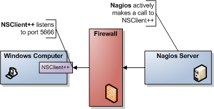
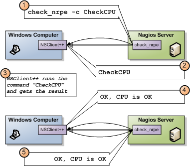
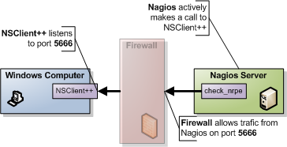

# Using NSClient++ with check_nrpe



NRPE is the most common way to connect to NSClient.
NRPE works much like NRPE for unix (if you are familiar with it) and in short you can say it relays a plugin request to a remote server.
NRPE acts like a simple transport layer allowing remote execution. The difference between regular NRPE and NSClient++ is that NSClient++ has built-in checks.
So with NSClient++ you get a lot of ready-to-use checks that wont require you to have scripts.
But if you choose you can disable all "modules" and stick with a pure NRPE installation and only external scripts.

## Overview of NRPE

For those not familiar with NRPE (Nagios Remote Plugin Execution) here is a quick introduction.



NRPE works much like SSH or telnet etc. It relays a command and awaits the result. In the above diagram what happens is:

1.  Nagios executes check_nrpe with the proper arguments.
2.  NSClient++ receives the command to be executed
3.  NSClient++ will execute the command and get a result on the form of <status>, <message> and optionally <performance data>
4.  NSClient++ sends the result back to Nagios
5.  Nagios gets the result from check_nrpe (and uses it much like any other plugin)

So in essence NRPE is merely a transport mechanism to send the result of a check command over the network.

## Nagios command line


NRPE require you to install a special plug-in on your Nagios server called NRPE.
The unix-side of NRPE consists of a server and a client on Nagios you only need the client so you can skip any "servers" or what not that it want to start when you install it.

The client is (generally) called check_nrpe and works like so:

```
./check_nrpe -H <nsclient++ server ip> -c <command> [-a <a> <list> <of> <arguments>]
```

*   `command` = The command (script) you want to run (often this is a pre-built command from within NSClient++)
*   `a` `list` `of` `arguments` = a list of arguments for the command.

So the simplest way to see if things are a-working just run it without a command and you should get a response specifying the version of "NRPE" (in this case NSClient++) like so:

```
./check_nrpe -H <nsclient++ server ip>
I (0.3.3.19 2008-07-02) seem to be doing fine...
```

And again like in the NSClient example don't worry if you get a timeout here since we have to configure NSClient++ before it actually works so this is expected.

## NSClient++ configuration


Next we need to configure NSClient++ to allow the server to connect.
The first thing you need to do to get things working is add the NRPEServer module.

```
[/modules]
...
NRPEServer = enabled
...
```

If you have not already done so (above) you also need to set which computers are allowed to query the agent.
This is set either under the `/settings/default` section (globally) or under the `/settings/NRPE/server` section (locally).
If you when you configured NSClient above set this globally you are already set to go. If not the key you need to change is the `allowed hosts`.
There is no password for NRPE.

-   `allowed hosts` = A list of addresses that is allowed to ask questions (i.e. your Nagios ip).
  The result should look like this (assuming your Nagios server ip address is 10.0.0.2):

```
[/settings/default]
allowed hosts=10.0.0.2
```

*After this restart the service.*

```
nscp service --stop
nscp service --start
... or ...
net stop nscp
net start nscp
```

Now feel free to try the command line agent again and hopefully things should work out perfectly.
Run the following command from your Nagios server.

```
./check_nrpe -H 10.0.0.1
I (0.3.3.19 2008-07-02) seem to be doing fine...
```

## Finding and solving problems



A good way to find and solve problems is to run NSClient++ in "test" mode this is done by stopping the service and starting it in "test" mode.

```
nscp service --stop
nscp test
... test mode ... (quit with: exit)
nscp service --start
```

When in test mode you will get a lot of interesting log messages when things are happening so it is fairly simple to figure out what is wrong.
So lets try this now and start NSClient++ in test mode like so:

```
nscp service --stop
nscp test
```

And you should see something along the following lines (it will look different depending on your setup):

```
Launching test mode - client mode
d NSClient++.cpp(1106) Enabling debug mode...
d NSClient++.cpp(494) Attempting to start NSCLient++ - 0.3.7.7 2009-07-05
d NSClient++.cpp(897) Loading plugin: NRPE server (w/ SSL)...
d \NRPEServer.cpp(121) Starting NRPE socket...
l NSClient++.cpp(600) NSCLient++ - 0.3.7.7 2009-07-05 Started!
d \Socket.h(675) Bound to: 0.0.0.0:5666
l NSClient++.cpp(402) Using settings from: INI-file
l NSClient++.cpp(403) Enter command to inject or exit to terminate...
```

Now you can run the command again from Nagios like so:

```
./check_nrpe -H 10.0.0.1
I (0.3.7.7 2009-07-05) seem to be doing fine...
```

And if you check the log of `NSClient++ test` you will this time not see anything and this is because the "check version" is an internal command so lets try with something slightly more interesting:

```
./check_nrpe -H 10.0.0.1 -c foobar
UNKNOWN: No handler for that command
```

And don't worry there is no foobar command but we will see how this looks in NSClient++

```
NSClient++.cpp(1034) Injecting: foobar:
NSClient++.cpp(1085) No handler for command: 'foobar'
\NSCHelper.cpp(238) No handler for command 'foobar'.
```

We shall get back a bit to this later on when we have configure NSClient++ more so lets leave this for now.

## NSClient++ configuration (revisited)


Setting up NSClient++ was previously pretty simple and there is a bit more to it then we have thus far visited.
This is because we have not configured anything yet all we can do now is talk to NSClient++ but not actually use it.
So in this section we shall cover the basics and first off are some of the configuration options available for NRPE.

### NRPE specific setting in NSClient++

*   `allow arguments`
    Since arguments can be potentially dangerous (it allows your users to control the execution) there is a flag (which   defaults to off) to enable arguments. So if you plan on configure NSClient++ from the Nagios end you need to enable   this. **But be warned this is a security issue you need to think about**. If you do not want to allow arguments you   can instead configure all checks in the nsclient.ini file and just execute the aliases from Nagios.
    One important issue with the `allow arguments` is that there are more then one! *Yes, more then one!*
    The reason for this is that you can allow arguments from NRPE and you can allow arguments for external scripts (it is   not the same option) which might seem a bit confusing at first.
    But actually quite nice. Using arguments for external scripts can potentially be more dangerous than allowing them   from NRPE (internal commands).
*   `allow nasty characters`
    This flag allows arguments to contain "dangerous" characters such as redirection and pipe (<>|) and makes things a   tad more dangerous. But if you decide to use arguments you most likely want to use this flag as well. **But again   this is a security risk**. Please also note this is also available for both NRPE and external scripts.S
*   `insecure`
    Allow `check_nrpe` to connect without using certificate based authentication.
*  `port`
    The port to listen to (default is 5666)
* `tls version`
    Version of TLS to use (default is 1.2+)
* `verify mode`
    If you want to verify the client certificate

So this if you enable this in the INI file you will end up with something like this (extract):

```
[/settings/NRPE/server]
allow arguments = true
allow nasty characters = false
allowed hosts = 192.168.0.1/24
port = 5666
```

There are a lot of other options as well but these are the most used ones for details please refer to the [reference section](../reference/NRPEServer).


### NRPE version 3 and 4

NSClient++ supports NRPE version 2 as well as 3 and 4 (from version 0.6.x), there is no configuration required to support the newer versions.
Please do note that ancient versions of `check_nrpe` may not support TLS1.2 which is required for NSClient++ 0.6.x and later.


### NRPE With certificates

NSClient++ supports certificates for NRPE which is a more secure way to connect to the agent.
To use certificates you need to generate a certificate and key and place them in the `security` folder.

Nagios has guide on generating and using certificates [here](https://support.nagios.com/kb/article/nrpe-v3-enhanced-security-519.html).

Once you have generated the certificate and key you need to configure NSClient++ to use the generated certificates.
While you can use separate file for certificate and key I tend to prefer to combine them like so:

```console
$ cat nagios_server.key nagios_server.pem > certificate.pem
$ cat ca.key ca.pem > ca.tmp.pem && mv ca.tmp.pem ca.pem
```
Now you should have two files (instead of four):
* `certificate.pem` - The certificate and key
* `ca.pem` - The CA certificate and key

These files should be copied to the `security` folder of the NSClient++ installation.
And then you configure it like so (this is the same options set by the installer if you pick the certificate option):

```
[/settings/NRPE/server]
insecure = false
tls version = tlsv1.2+
verify mode = peer-cert
```

You can also set the certificate but these are the default values if you set `insecure` to false:
```
[/settings/NRPE/server]
ca=${certificate-path}/ca.pem
certificate=${certificate-path}/certificate.pem
```

### NRPE specific settings in NSClient++


### Modules

The other thing which you should configure is which modules to use.
There is several modules which can be used to check various aspects of your system.
So choosing which you need can be a bit of work.
Here we shall start out with the basic ones and for details on the rest check out the [references section]/../references).

| Module               | Description                                                       | Commands                    |
|----------------------|-------------------------------------------------------------------|-----------------------------|
| CheckSystem          | Handles many system checks                                        | check_cpu, check_memory etc |
| CheckDisk            | Handles Disk related checks                                       | check_drivesize             |
| CheckExternalScripts | Handles aliases (which is what we will use) and external scripts. | N/A                         |
| NRPEServer           | Listens and responds to incoming requests from Nagios via NRPE    | N/A                         |
| ...                  | There are a lot more modules                                      | ...                         |

The finished modules section from the INI file will look like so:

```
[/modules]
CheckSystem=enabled
CheckDisk=enabled
CheckExternalScripts=enabled
NRPEServer=enabled
```

Now we have done some basic setup of NSClient++ and we can continue to try using it a bit more before we continue with configuring Nagios.

## Nagios command line (revisited)


Now that we have the agent up and running (if not probably want to go back over the previous sections to get it up and running before reading on) what can we do with it?. From here on we will assume you have allow arguments and metachars enabled since it makes it simpler to try things out **BEWARE** that there are security implications to this so you might wanna read up before rolling this configuration into production.

As we stated before check_nrpe is a lot more powerful than the legacy check_nt and there is a lot of built in commands as well as a lot of external ones you can use.
Lets start with a simple one CheckCPU and see how to use it.

If we check the docs for it it has an example like so:

```
checkCPU warn=80 crit=90 time=20m time=10s time=4
CPU Load ok.|'20m average'=11%;80;90; '10s average'=7%;80;90; '4 average'=10%;80;90;
```

Now this is a "nscp test mode command" so it is not usable in it self for you instead you need to change it slightly.
The first word is the command and the rest are arguments.
check_nrpe has two options for settings commands (-c) and arguments (-a) and is used like so:

```
check_nrpe ... -c <command> [-a <argument> <argument> <argument>]
```

in this case (CheckCPU) this translates to:

```
check_nrpe ... -c CheckCPU -a warn=80 crit=90 time=20m time=10s time=4
CPU Load ok.|'20m average'=11%;80;90; '10s average'=7%;80;90; '4 average'=10%;80;90;
```

And that is as hard as it gets all you need to do is figure out which arguments you want to use for the command and stack them all in a long line.

## Nagios configuration

Nagios configuration is in itself a whole chapter and this is just a quick peek on how you can do things. First off there are a few concepts to understand:

*   templates are the same as the corresponding item but they have a flag register = 0 which prevents them from being listed
*   services are essentially checks (is check CPU)
*   hosts are essentially computers
*   groups are an important concept which I ignore here for simplicity (I recommend you use it)

The configuration is at the end layer quite simple you have a "check" and a "host" and you connect them with a service. Like I show at the bottom line in the diagram above. Whats makes this a tad more complicated is that you can inherit things from a "parent" definition. Which is what I show with arrows (bottom to top) above. The templates with dashed lines are the base templates which all services and hosts inherit.

### Template

First, its best practice to create a new template for each different type of host you'll be monitoring. Let's create a new template for windows servers.

```
define host{
    name                  tpl-windows-servers ; Name of this template
    use                   generic-host ; Inherit default values
    check_period          24x7
    check_interval        5
    retry_interval        1
    max_check_attempts    10
    check_command         check-host-alive
    notification_period   24x7
    notification_interval 30
    notification_options  d,r
    contact_groups        admins
    register              0 ; DONT REGISTER THIS - ITS A TEMPLATE
}
```
Notice that the tpl-windows-servers template definition is inheriting default values from the generic-host template, which is defined in the sample localhost.cfg file that gets installed when you follow the Nagios quick-start installation guide.

### Host definition

Next we need to define a new host for the remote windows server that references the newly created tpl-windows-servers host template.

```
define host{
  use          tpl-windows-servers ; Inherit default values from a template
  host_name    windowshost ; The name we're giving to this server
  alias        My First Windows Server ; A longer name for the server
  address      10.0.0.2 ; IP address of the server
}
```

Defining a service for monitoring the remote Windows server.

### Service definitions

The following service will monitor the CPU load on the remote host. The "alias_cpu" argument which is passed to the check_nrpe command definition tells NSClient++ to run the "alias_cpu" command as defined in the alias section of the nsclient.ini file.

```
define service{
    use                 generic-service
    host_name           windowshost
    service_description CPU Load
    check_command       check_nrpe!alias_cpu
}
```

The following service will monitor the free drive space on /dev/hda1 on the remote host.

```
define service{
    use                  generic-service
    host_name            windowshost
    service_description  Free Space
    check_command        check_nrpe!alias_disk
}
```
