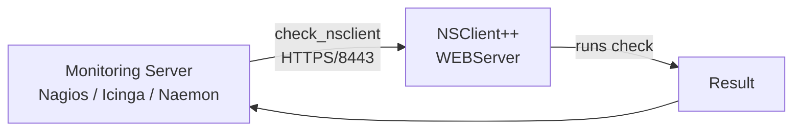

# Active Checks over the REST API

**Goal:** Run NSClient++ checks from your monitoring server over HTTPS instead of NRPE, using the standalone [`check_nsclient`](../check_nsclient/index.md) command line client as the check plugin.

<!-- @formatter:off -->
!!! tip
    This is the same pull-style pattern as [NRPE](nrpe.md) — the monitoring
    server asks, the agent answers — but over the REST API the web UI already
    uses. If you have no reason to move away from NRPE, there is nothing wrong
    with staying on it.
<!-- @formatter:on -->

---

## How it works

`check_nsclient` is a self-contained binary that speaks the NSClient++
[REST API](../api/rest/index.md). Given a query name it calls
`/api/v2/queries/<name>/commands/execute` on the agent, and
`queries execute-nagios` renders the answer the way a Nagios plugin is expected
to: one `message|perfdata` line on stdout, the check status as the exit code.



Credentials are not passed on the command line. You log in once per agent,
which stores an API key in the credential store of the monitoring server, and
every later check refers to that stored connection by its **profile** name.

### Why you might want this

| | NRPE | REST API |
|---|---|---|
| Port | `5666`, in addition to the web UI | `8443`, the one the web UI already uses |
| Module | `NRPEServer` | `WEBServer` |
| Credentials | Shared transport-level trust (`allowed hosts`, client certs) | Per-user password, exchanged once for a revocable API key |
| Payload limits | Fixed-size buffers, truncation on long output | JSON, no protocol-level truncation |
| Argument handling | Guarded by `allow arguments` / `allow nasty characters` | Guarded by [per-user roles](../reference/generic/WEBServer.md#web-server-roles) |
| Beyond checks | Checks only | Also settings, logs, modules, scripts and metrics |

The trade-off is that every agent needs the web server enabled and a login
performed from the monitoring server — which is more setup than dropping an
NRPE stanza into `nsclient.ini`.

---

## Prerequisites

**On each monitored host**, the `WEBServer` module must be enabled with a
password set:

```
nscp web install --https --password <MY SECURE PASSWORD>
```

The agent must be reachable on port `8443` from the monitoring server, so make
sure `allowed hosts` includes it:

```ini
[/settings/WEB/server]
allowed hosts = 10.0.0.0/24
```

See [Using the Web Interface](../setup/web-interface.md) for the full setup,
including how to give the agent a certificate that validates.

**On the monitoring server**, install `check_nsclient` — a single binary, no
runtime dependencies. Put it in the plugin directory so it sits next to your
other checks:

```commandline
$ VERSION=<VERSION>
$ curl -sSLo check_nsclient \
    "https://github.com/mickem/check_nsclient/releases/download/${VERSION}/check_nsclient-${VERSION}-linux-x64"
$ sudo install -m 0755 check_nsclient /usr/lib/nagios/plugins/check_nsclient
```

On a **Windows** monitoring host the NSClient++ MSI already installs the client
as `C:\Program Files\NSClient++\check_nsclient.exe`, so there is nothing to
download. See [Installation](../check_nsclient/index.md#installation) for the
details.

---

## Logging in to each agent

Run the login **as the user the monitoring server runs checks as** — the API
key lands in that user's credential store, and a check running as somebody else
will not find it:

```commandline
$ sudo -u nagios /usr/lib/nagios/plugins/check_nsclient nsclient auth login web-01 \
    --url https://web-01.example.com:8443 \
    --password <MY SECURE PASSWORD> \
    --ca /etc/ssl/certs/my-ca.pem
Successfully logged in
```

`web-01` is the profile name. Name profiles after the host so a command
definition can build them from `$HOSTNAME$`.

<!-- @formatter:off -->
!!! warning "Credential storage on a headless server"
    On Linux the credentials go into the Secret Service (`libsecret`), which
    needs a running keyring daemon — something a headless monitoring server
    often does not have. Confirm the login survives a fresh shell before
    wiring up checks:

    ```commandline
    $ sudo -u nagios /usr/lib/nagios/plugins/check_nsclient nsclient --profile web-01 ping
    Successfully pinged NSClient++ version 0.18.0 2026-08-29
    ```

    See [Where credentials are stored](../check_nsclient/nsclient.md#where-credentials-are-stored)
    for the details.
<!-- @formatter:on -->

Verify what you have with `profile list`:

```commandline
$ check_nsclient profile list
╭─────────┬──────────────────────────────────┬──────────┬──────────┬─────────┬───────────┬──────────────╮
│ id      │ url                              │ username │ insecure │ default │ has_token │ has_password │
├─────────┼──────────────────────────────────┼──────────┼──────────┼─────────┼───────────┼──────────────┤
│ web-01  │ https://web-01.example.com:8443  │ admin    │ no       │ yes     │ yes       │ yes          │
│ db-01   │ https://db-01.example.com:8443   │ admin    │ no       │ no      │ yes       │ yes          │
╰─────────┴──────────────────────────────────┴──────────┴──────────┴─────────┴───────────┴──────────────╯
```

---

## Running a check by hand

Always confirm a check works from the shell before putting it in a
configuration file:

```commandline
$ check_nsclient nsclient --profile web-01 queries execute-nagios check_cpu
OK: CPU load is ok.|'total 5s'=9%;80;90 'total 1m'=6%;80;90 'total 5m'=2%;80;90
$ echo $?
0
```

Arguments come after the query name, exactly as the check expects them:

```commandline
$ check_nsclient nsclient --profile web-01 queries execute-nagios \
    check_drivesize drive=/ "warning=used>80%" "critical=used>90%"
OK: All 1 drive(s) are ok|'/ used'=13.7GB;80.5;90.6;0;100.7
```

The exit codes are the Nagios ones:

| Exit code | Status   |
|-----------|----------|
| `0`       | OK       |
| `1`       | WARNING  |
| `2`       | CRITICAL |
| `3`       | UNKNOWN  |

Not sure what a host offers? Ask it — this is the part NRPE cannot do:

```commandline
$ check_nsclient nsclient --profile web-01 queries list
$ check_nsclient nsclient --profile web-01 queries show check_drivesize
```

---

## Nagios server-side configuration

One command definition covers every check, because the query name is an
argument:

```
define command {
    command_name    check_nscp_rest
    command_line    $USER1$/check_nsclient nsclient --profile $HOSTNAME$ queries execute-nagios $ARG1$
}

define command {
    command_name    check_nscp_rest_args
    command_line    $USER1$/check_nsclient nsclient --profile $HOSTNAME$ queries execute-nagios $ARG1$ $ARG2$
}
```

With profiles named after the host, the service definitions stay short:

```
define service {
    use                     generic-service
    host_name               web-01
    service_description     CPU Load
    check_command           check_nscp_rest!check_cpu
}

define service {
    use                     generic-service
    host_name               web-01
    service_description     Disk Space
    check_command           check_nscp_rest_args!check_drivesize!drive=/ "warning=used>80%"
}
```

Add `--timeout-s` if your checks are slower than the default 30 seconds, and
keep it below the monitoring server's own plugin timeout:

```
    command_line    $USER1$/check_nsclient nsclient --profile $HOSTNAME$ --timeout-s 20 queries execute-nagios $ARG1$
```

### Icinga 2

The same plugin, expressed as an Icinga 2 `CheckCommand`:

```
object CheckCommand "nscp_rest" {
  command = [ PluginDir + "/check_nsclient" ]

  arguments = {
    "nsclient" = { skip_key = true; order = 0 }
    "--profile" = { value = "$nscp_rest_profile$"; order = 1 }
    "queries" = { skip_key = true; order = 2 }
    "execute-nagios" = { skip_key = true; order = 3 }
    "query" = { skip_key = true; value = "$nscp_rest_query$"; order = 4 }
  }

  vars.nscp_rest_profile = "$host.name$"
}

apply Service "cpu" {
  check_command = "nscp_rest"
  vars.nscp_rest_query = "check_cpu"
  assign where host.vars.nscp_rest
}
```

---

## Rolling it out to many hosts

Logging in is a one-time step per agent, so a loop over your inventory is
usually enough:

```commandline
$ for host in web-01 web-02 db-01; do
>   sudo -u nagios /usr/lib/nagios/plugins/check_nsclient nsclient auth login "$host" \
>       --url "https://${host}.example.com:8443" \
>       --password "$NSCP_PASSWORD" \
>       --ca /etc/ssl/certs/my-ca.pem
> done
```

If a key is ever lost or leaked, revoke it on the agent and forget it locally in
one step:

```commandline
$ check_nsclient nsclient --profile web-01 auth logout
```

---

## Limiting what the monitoring server may do

The API key inherits the permissions of the user it was issued for, so do not
point your monitoring server at `admin` — that account can rewrite the agent's
configuration. NSClient++ ships a built-in `monitoring` role that grants exactly
`queries.execute`, `aliases.list`, `login.get` and `metrics.get`; give the
monitoring server its own user with that role:

```ini
[/settings/WEB/server/users/nagios]
password = <A DIFFERENT SECURE PASSWORD>
role = monitoring
```

Then log in as that user instead of `admin`:

```commandline
$ check_nsclient nsclient auth login web-01 --url https://web-01.example.com:8443 \
    --username nagios --password <A DIFFERENT SECURE PASSWORD>
```

<!-- @formatter:off -->
!!! note
    The `monitoring` role deliberately excludes `queries.list` and
    `queries.get`, so `queries list` and `queries show` will fail for this user.
    Explore with an `admin` (or `client`) profile and run the scheduled checks
    with the restricted one.
<!-- @formatter:on -->

See [Web server roles](../reference/generic/WEBServer.md#web-server-roles)
for the built-in roles and what each one grants, and
[Permissions](../concepts/permissions.md) for the separate, agent-wide engine
that controls which commands a caller may run at all.

---

## Troubleshooting

**`Error: NSClient++ profile 'web-01' not found.`** — the profile does not
exist for the user running the check. Re-run `auth login` under that user (the
`sudo -u nagios` above), not as root.

**`invalid peer certificate: UnknownIssuer`** — the agent's certificate is not
signed by anything the monitoring server trusts. Pass `--ca` with your CA
bundle at login time, or `--insecure` to skip validation (not recommended
outside a lab). [Adding certificates to NSClient++](../setup/web-interface.md#adding-certificates-to-nsclient)
covers getting a certificate that validates.

**Connection refused / timeout** — the `WEBServer` module is not loaded, the
port is firewalled, or `allowed hosts` excludes the monitoring server. Check
from the agent side with `nscp test`, and see what the client actually did with
`-d`:

```commandline
$ check_nsclient -d nsclient --profile web-01 ping
[debug] Debug output enabled (level 1)
[debug] GET https://web-01.example.com:8443/api/v2/info
[debug] 200 OK from api/v2/info
Successfully pinged NSClient++ version 0.18.0 2026-08-29
```

`-dd` also dumps the body of error responses, which is where NSClient++ puts
its explanation.

**`403` / permission denied on a query** — the role of the user the key was
issued for does not include `queries.execute`. See
[Web server roles](../reference/generic/WEBServer.md#web-server-roles).

---

## Next Steps

- [check_nsclient](../check_nsclient/index.md) — the full command line reference
- [`queries execute-nagios`](../check_nsclient/nsclient.md#queries-execute-nagios) — every option of the command used here
- [Active Monitoring with NRPE](nrpe.md) — the classic alternative, and how it compares
- [Reference: WEBServer](../reference/generic/WEBServer.md) — every web server setting in detail
- [REST API](../api/rest/index.md) — if you would rather call the API directly
