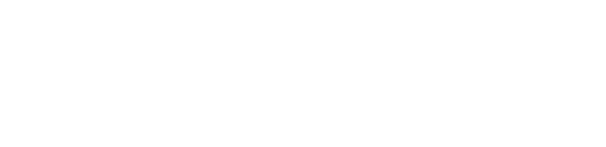

## :octicons-info-16: About NSClient++

NSClient is an [:material-alert-box-outline: agent](nsclient.md) designed originally to work with Nagios but has
since evolved into a fully fledged monitoring agent which can be used with numerous monitoring tools. If you want more
in-depth information see the [:material-head-question: documentation](https://docs.nsclient.org/)</a>
instead.

* [:material-alert-box-outline: About NSClient++](nsclient.md)
* [:material-head-question: Documentation](/docs)

## :material-rocket-launch: Getting started

I know NSClient++ can seem daunting. But is really isn't, especially not now with all
the [:material-head-question: documentation](/docs)
and [:fontawesome-solid-graduation-cap: tutorials](https://docs.nsclient.org/tutorial/index.html).
But it is "open-ended" so before you start be sure to read through
the [:fontawesome-solid-graduation-cap: tutorial](https://docs.nsclient.org/tutorial/index.html) for your
scenario, and we are sure you will be on a journey towards #MonitoringLove.

* [:fontawesome-solid-graduation-cap: Tutorials](https://docs.nsclient.org/tutorial/index.html)
* [:material-head-question: Documentation](/docs)

## :material-download: Download NSClient++

You can [:material-download: download the latest version](/download) or you
can [:material-archive: see all old releases](https://github.com/mickem/nscp/releases).

* [:material-download: Download the latest version](/download)
* [:material-archive: See all releases](https://github.com/mickem/nscp/releases)

## :fontawesome-solid-question: Getting help

You can read the [:material-head-question: documentation](https://docs.nsclient.org/). And if you can not find it there
head on over to the [:material-chat: forums](https://github.com/mickem/nscp/discussions) and ask a question there
instead.

* [:material-head-question: Documentation](https://docs.nsclient.org/)
* [:material-chat: Forums](https://github.com/mickem/nscp/discussions)

## :fontawesome-solid-user: Getting involved

Getting involved is easy!
If you have questions or want to connect with the community head over to
the [:material-chat: Forums](https://github.com/mickem/nscp/discussions). Or if you have issues, feature requests you
can use our [:octicons-issue-opened-16: issue tracker](https://github.com/mickem/nscp/issues) on GitHub.
We are also interested in all contributions big or small.

* [:material-chat: Forums](https://github.com/mickem/nscp/discussions)
* [:octicons-issue-opened-16: Issues](https://github.com/mickem/nscp/issues)

## :moneybag: Giving back

NSClient++ is a free (as in both beer and speech) program which is NOT backed by a big corporation. We dont belive in
open<strong>core</strong> instead we really belive in open<strong>source</strong>. So feel free to contribute by
buying <a href="/support"><i class="fa fa-support"></i> support</a> or <a href="/donate"><i class="fa fa-money"></i>
donate</a>

* [:simple-paypal: Donate money via paypal](https://paypal.me/michaelmedin?country.x=SE&locale.x=en_US)
* [:simple-githubsponsors: Sponsor development on GitHub](https://github.com/sponsors/mickem)

## :fontawesome-solid-heart: Sponsors

  <!-- Nagios logo start -->
  

    
  

  <!-- End -->

