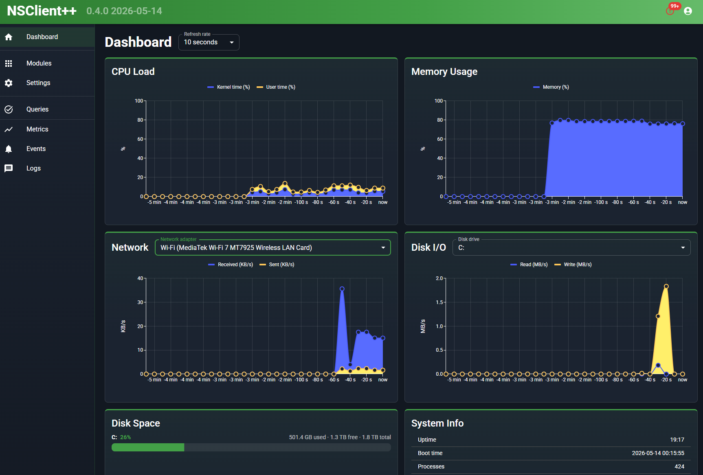
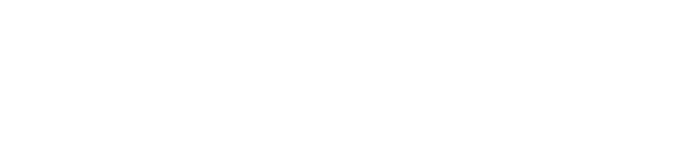

---
hide:
  - navigation
  - toc
---

# NSClient++

A simple, powerful, and secure monitoring agent for **Windows** and **Linux**.
Works with Nagios, Icinga, Op5, Prometheus, check_mk — and anything that speaks NRPE, NSCA, NRDP, or REST.

[:material-download: Download latest](https://github.com/mickem/nscp/releases/latest){ .md-button .md-button--primary data-release="download-link" }
[:fontawesome-solid-graduation-cap: Quick Start](docs/quick-start.md){ .md-button }

Released recently &middot; <a href="https://github.com/mickem/nscp/releases" data-release="notes-link">release notes</a>

## :material-checkbox-marked-circle-outline: Why NSClient++

- :material-laptop: **Cross-platform** — Windows and major Linux distros ([details](docs/setup/supported-platforms.md))
- :material-connection: **Many protocols** — NRPE, NSCA, NSCA-NG, NRDP, check_mk, Icinga 2, Op5, Graphite, Syslog, SMTP, REST, Prometheus/OpenMetrics
- :material-view-dashboard: **Web UI** with live dashboards and check explorer
- :material-language-python: **Scriptable** in Python, Lua, or any external script
- :material-shield-check: **Secure by default** — TLS, client certs, allowed-hosts

## :material-newspaper: Latest releases

Loading latest releases…

[All news :material-arrow-right:](news/index.md){ .md-button }
[All releases on GitHub :material-arrow-right:](https://github.com/mickem/nscp/releases){ .md-button }

## :material-rocket-launch: Get started

- [:fontawesome-solid-graduation-cap: Quick Start](docs/quick-start.md) — 10-minute walkthrough
- [:material-download: Installation guide](docs/setup/installing.md) — MSI options & silent install
- [:material-shield-key: Securing the agent](docs/setup/securing.md) — TLS & client certs
- [:material-monitor-dashboard: Web Interface](docs/setup/web-interface.md)

## :material-head-question: Documentation

- [:material-format-list-bulleted: Monitoring scenarios](docs/scenarios/index.md) — common real-world setups
- [:material-bookshelf: Reference](docs/reference/index.md) — every module & command
- [:material-school: Concepts](docs/concepts/index.md) — how it works under the hood
- [:material-frequently-asked-questions: FAQ](docs/faq.md)

## :material-account-group: Community

- [:material-chat: Forums](https://github.com/mickem/nscp/discussions)
- [:octicons-issue-opened-16: Issues](https://github.com/mickem/nscp/issues)
- [:simple-paypal: Donate via PayPal](https://paypal.me/michaelmedin?country.x=SE&locale.x=en_US)
- [:simple-githubsponsors: Sponsor on GitHub](https://github.com/sponsors/mickem)

---

## :fontawesome-solid-heart: Sponsors

  

    
  

