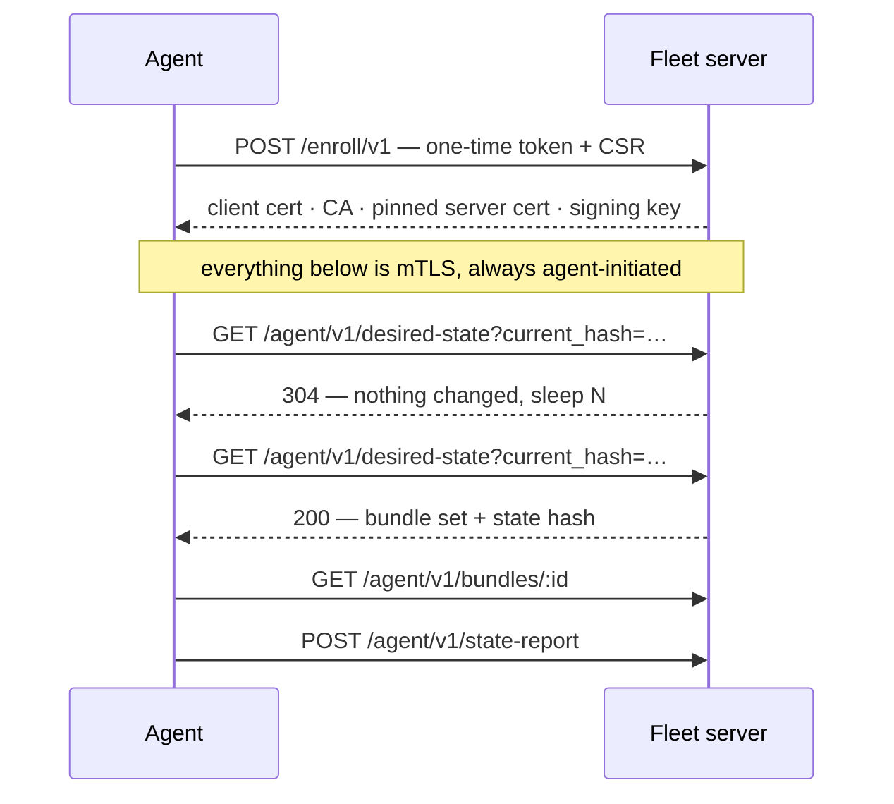
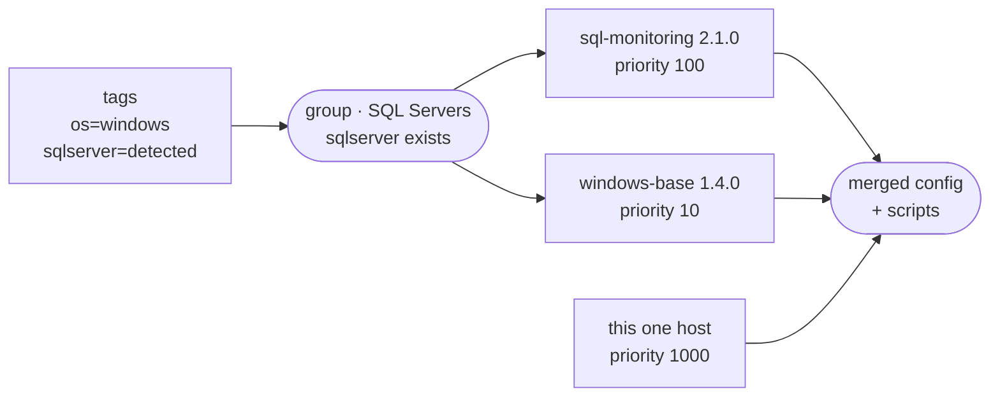

---
date:
  created: 2026-09-14
slug: nsclient-fleet
---

# NSClient Fleet 0.1.0 — central configuration management for NSClient++

**NSClient Fleet** is a new, separate product: a server that holds the
configuration for a whole estate of NSClient++ agents, hands each host the part
that applies to it, and reports what every host is actually running. The first
release is out.

Until now there have been two ways to configure a large number of agents. You
can point each one at an ini file on a web server and let it pull the file
(`CONFIGURATION_TYPE=`), or push settings to each agent over the REST API from
whatever orchestration you already run. Both work, and both remain supported.
Neither keeps track of the estate, though: the only inventory is the one you
maintain by hand, so questions like *which version of `check_backup.ps1` is on
which host* or *which hosts have not checked in since Tuesday* have nothing to
answer them.

Fleet turns that around. Agents enroll themselves and report what they are, so
the server builds the inventory instead of consuming one. Grouping by reported
facts, configuration assembled per host, and drift reported as a comparison
rather than a guess all follow from that.

It lives in [its own repository](https://github.com/mickem/nsclient-fleet-server)
and is entirely optional — NSClient++ works exactly as it always has without it.

## ✨ Highlights

- 🏷️ **Self-enrolment and self-describing hosts.** A few extra MSI properties and
  the host appears in the inventory with its OS, version, agent build, drives
  and detected roles, as tags reported by the agent rather than typed in.
- 🎯 **Groups select hosts by tag; bundles attach to groups.** A host that starts
  reporting `sqlserver=detected` falls into the SQL group and picks up the SQL
  monitoring bundle on its next poll.
- 🧩 **Bundle templates that edit real INI.** The forms are bound to actual INI
  keys and write back with line edits, so the INI text stays the source of truth
  and hand-edits survive.
- 🔐 **Encrypted bundles.** Sealed in the browser with AES-256-GCM before upload;
  the server stores an 8-byte key fingerprint and delivers a blob it cannot
  read. The agent option `require encrypted bundles` makes it refuse anything
  unsealed.
- 📊 **Host status derived from reported hashes.** In sync, out of sync, offline
  and lost, plus a *local config* flag for hosts carrying local settings that
  outrank what the server sends.
- 🔌 **One port.** 443 serves the operator UI, the agents and certificate
  issuance, separated on the TLS handshake by ALPN.
- 📦 **One static binary and a SQLite file.** No runtime and no database server;
  Linux and Windows, x86-64 and arm64, or a container image.

## What it takes over

A management server is one more thing to run, patch and be woken by, so it is
worth being clear about what comes out in exchange. In a typical config-file
setup, Fleet replaces:

- the orchestration that pushed configuration
- the web server and the directory layout behind it
- the include-file naming convention
- the inventory spreadsheet
- tracking which script is deployed where

## Installation and enrolment

Installing an agent into a fleet uses the same MSI command line as before, with
different properties:

```text
msiexec /qn /i NSCP-<version>-x64.msi ^
    FLEET_SERVER=https://fleet.corp.example ^
    FLEET_TOKEN=<one-time token> ^
    FLEET_BUNDLE_KEY=<your key>
```

Where the config-file approach pointed at an ini URL, this points at a server and
carries a one-time token, so moving between the two is a change of MSI
properties rather than a migration.

The token is single-use and short-lived. The agent generates its own keypair,
sends a certificate request, and receives a client certificate along with
everything it needs to trust the server; the token is then spent and will not be
accepted again. After enrolment there is no token anywhere — the certificate is
the identity.



Every exchange after enrolment is initiated by the agent, so there is no inbound
connection to a monitored host, no port to open and nothing pushed. Most polls
return 304.

## Hosts describe themselves

Agents already know a good deal about the machine they run on, and now report it
as tags:

| Tag | Where it comes from |
|-----|---------------------|
| `os` | the agent |
| `os_name` | `Windows Server 2022` — for reading |
| `os_version` | `10.0.20348` — for matching |
| `nscp_version` | which agent build is on the host |
| `drives` | `c:,d:` — from CheckDisk |
| `sqlserver` | `detected` — read from the registry, so a stopped instance still counts |
| *operator-defined* | any service or unit mapped to a tag: `MSSQLSERVER=sql-server` |

Scripts can publish tags too, which covers the facts specific to a given estate:
whether IIS is listening on 443 (`role=web-frontend`), which in-house
application is deployed (`app=billing`, `app_version=4.2`), or whether a
provisioning marker file exists (`env=lab`). A script-reported tag behaves
exactly like a built-in one in groups and selectors. The agent sends its full tag
set on every report, so a tag that stops being reported simply disappears — there
is no cleanup job and no stale inventory.

Because these are the host's own claims about itself, a group only matches on
agent-reported tags if it is built to do so. Reported facts are meant for
grouping, not access control; anything gating access to secrets should match on
operator-set tags instead.

## Groups and bundles



A group is a rule against tags rather than a list of machines — `sqlserver`
exists, `os` is in a given set, this and not that. Groups are built in the UI
rather than typed as a query, so there is no expression language to inject into.

Bundles attach to groups, not to hosts, and each attachment carries a priority.
Priorities are layers: `windows-base` at 10 underneath, `sql-monitoring` at 100
on top. Later layers win, and a bundle can delete a key set by the layer below.
For cases that genuinely concern a single machine, a host override sits above
every group at priority 1000.

## Bundles

A new bundle starts from a template. The set is derived from the
[scenario guides](../../docs/scenarios/index.md) — Windows and Linux server
health, disk space, services and processes, performance counters, real-time
alerts, SQL Server and network checks — plus one per delivery mechanism (NRPE,
Checkmk, Prometheus, NSCA, NSCA-NG, Icinga 2, NRDP, Graphite and scheduled
baselines).

Two things about how they are built are worth knowing.

**Each template covers one concern.** Check templates define transport-neutral
aliases and say nothing about how results leave the host; each transport is a
separate bundle. A group therefore gets "Windows health" and "deliver over NRPE"
as two layers, and changing monitoring system means swapping one bundle rather
than editing checks.

**The form is a view of the INI, not a generator.** Every field is bound to real
INI keys and the INI text remains the source of truth: the form reads values out
of the text and writes back with line edits, so raw editing, comments and
hand-written sections survive a round trip. A bundle remembers which template
produced it, so reopening it later gives the form back rather than unstructured
INI.

Bundles can also be built without the UI, since a bundle is a zip file:

```text
windows-base-1.4.1.zip
├── bundle.toml        name = "windows-base" · version = "1.4.1"
├── config.json        the config fragment — JSON Merge Patch (RFC 7396)
└── scripts/
    └── check_backup.ps1
```

```bash
curl https://fleet.corp.example/api/bundles \
  -H "Authorization: Bearer nsk_…" \
  -F name=windows-base -F version=1.4.1 \
  -F bundle=@windows-base-1.4.1.zip
```

The config fragment is a standard JSON Merge Patch — objects deep-merge, scalars
replace, `null` deletes — and the agent renders the merged result to NSClient INI
on the host. Layering is therefore a property of the format rather than of the
editor, and a hand-built bundle participates in it exactly like a template-built
one. Upload is an API key operation, so bundles can live in git and be built and
published by CI.

## Encrypted bundles

Bundles carrying credentials — SQL Server connection strings, passive transport
passwords — can be encrypted in the browser before upload, with AES-256-GCM and
a key the server never receives. The server stores an 8-byte key fingerprint,
enough for the UI to report a key mismatch, and otherwise signs, stores and
delivers a blob it cannot read.

The bundle's name and version are authenticated into the ciphertext, so a
compromised server cannot serve one validly encrypted bundle in place of
another; a mismatch fails decryption. Keys reach agents at install time, over the
same out-of-band channel as the enrolment token.

The agent option **`require encrypted bundles`** makes an agent refuse anything
unsealed. Since only a key holder can produce a bundle that decrypts, a server
facing agents in that configuration cannot deliver configuration or scripts of
its own making.

The trade-off is that **there is no escrow**: recovery would require the server
to hold the key. A lost key means re-uploading the affected bundles under a new
one. Rotation is supported — agents hold a key list, newest first, and select by
fingerprint, so bundles encrypted under the previous key keep working during a
rotation.

## Host status and drift

| Status | Meaning | Where it comes from |
|--------|---------|---------------------|
| **in sync** | running exactly what the server would send it | the hash the agent reported matches the hash the server would serve now |
| **out of sync** | a change is pending, or an apply failed | hashes differ; an agent never reports a state it did not fully apply |
| **offline** | quiet for three poll intervals | a reboot or a blip; often resolves itself |
| **lost** | quiet for 48 hours | stopped, uninstalled, firewalled, or the machine is gone |

Each host reports the hash of the configuration it finished applying, and the
server compares that against what it would serve the host now. Because an agent
will not report a state it did not reach, a failed apply shows as out of sync
rather than as success. Silence is tracked separately: three missed polls reads
as offline, two days of silence as lost. Neither status revokes or deletes
anything.

There is also a **local config** flag. NSClient++ reads local settings ahead of
fleet-managed ones, so a locally set key shadows a pushed one. The agent reports
*that* a host has local configuration — never its content, which is where
credentials tend to live — so partly managed hosts are visible rather than
reported as in sync when they are not.

## Network and TLS

443 is the only port. The operator UI, the agents and certificate issuance share
it, separated on the TLS handshake:

| The client offers | It gets |
|-------------------|---------|
| ALPN `nsclient-fleet/1` | pinned self-signed cert · client certificate required |
| anything else | Let's Encrypt cert · no client certificate requested |
| ALPN `acme-tls/1` | throwaway challenge cert — handshake only |

Agents pin a single certificate and do not consult the system trust store, so
agent connectivity does not depend on certificate issuance being reachable, and
on-prem and air-gapped installations behave the same as internet-facing ones.
Browsers are never asked for a client certificate, so there is no certificate
picker and no tenant information exposed to visitors.

The limitation this implies is worth planning for: anything terminating TLS
between an agent and the server — an inspecting proxy, a CDN that terminates
TLS, most L7 load balancers — breaks the agent connection. The TCP connection
has to be passed through.

## Security model

**Identity comes from the certificate.** The tenant is derived from the
certificate's issuer rather than from anything the certificate claims about
itself, and the host id is a `spiffe://` name cross-checked against that issuer.
The server constructs the certificate; the request contributes a public key and
nothing else. No request body carries a host id, token or identity.

**Configuration and scripts are signed.** SHA-256 for integrity and Ed25519 over
the digest for authenticity, with the signing key kept separate from the CA, so a
CA compromise does not allow bundles to be forged. Group membership is re-checked
on every download, so a compromised host cannot fetch another group's scripts.

An agent that cannot verify what it received does not apply it, does not fall
back to an older unsigned state and does not go quiet: it keeps running the last
known-good configuration and reports the failure.

One consequence is worth stating directly. By default the server can cause an
agent to execute code, because deploying scripts is one of the things it is for
— the trust boundary is the management server, in the same way that the trust
boundary for a scripting module is the script files. With
`require encrypted bundles` enabled, that is no longer the case.

## Known limitations

This is a 0.1.0 release, and the limitations are worth reading before planning
around it.

- **It is new and will have bugs**, the UI especially.
- **Templates will change**, and the way bundles are bound to tags is likely to
  gain a richer language.
- **Agent upgrades are not implemented.** They are planned for after the modern
  folder layout becomes the default.
- **Script dependencies are not handled**, and may never be.
- **Fleet configuration on the agent, including the bundle key, is stored in
  clear text** on every host. Encrypting it is on the roadmap.

Configuration written today is not at risk from any of this: the configuration
format is owned by NSClient++ and is not changing.

Also planned: template variables for per-host values such as thresholds, more
fleet-configuration management on top of the bundle-key and CA rotation that
already exist, and adapters that feed discovered hosts into Nagios and other
monitoring systems.

## Running it alongside an existing setup

Fleet does not require migrating anything. The config-file and REST approaches
remain supported, with no deadline attached. An enrolled agent does not have its
`nsclient.ini` touched — local settings are left in place and reported as local
config — and leaving a fleet is the same MSI properties pointed elsewhere.

A handful of non-critical hosts is enough to see the inventory, grouping and
status behaviour with real data. Reports of what breaks are welcome on
[GitHub issues](https://github.com/mickem/nsclient-fleet-server/issues) and in
[discussions](https://github.com/mickem/nscp/discussions).

## Getting started

- [What NSClient Fleet is and how it fits together](../../docs/fleet/index.md)
- [Running it in Docker](../../docs/fleet/docker.md) — one `docker run` and a
  volume; the quickest way to get a server you can enroll against
- [Installing on Linux](../../docs/fleet/linux-install.md) ·
  [on Windows](../../docs/fleet/windows-install.md)
- [Deployment reference](../../docs/fleet/deployment.md) — ports, DNS, the two
  certificates, environment variables, backups and capacity
- [Central management with NSClient Fleet](../../docs/setup/fleet.md) — the
  agent side of the round trip
- [Building your own agent](../../docs/fleet/agent-implementation.md)

## Download

[Download NSClient Fleet from GitHub](https://github.com/mickem/nsclient-fleet-server/releases/latest){ .md-button .md-button--primary }
[All downloads](../../download.md){ .md-button }

// Michael Medin
