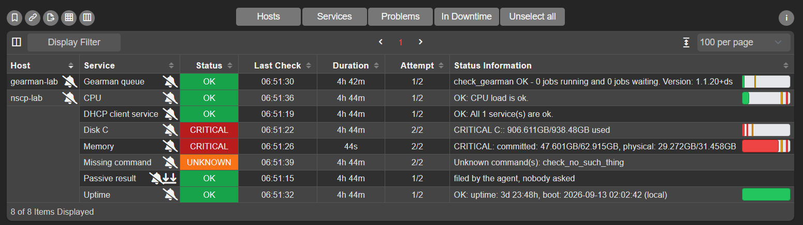

---
date:
  created: 2026-09-17
---

# Thank you, Nagios World Conference 2026

Nagios World Conference 2026 wrapped up in the Twin Cities today, so first of all:
thank you. To everyone who came to my two sessions, asked questions, or said hi. 

Thanks also to the Nagios event team. I genuinely believe that this is one of the 
best conferences in the world. And you proved that you can do this consistently. 
Great talks, great venue, great catering and excellent evening events.

## The slides

Both decks are up:

- [Managing the NSClient++ Agent the Easy Way](https://nsclient.org/slides/managing-the-nsclient-agent-the-easy-way-nwc2026.pdf)
  (Tuesday, Track 1)
- [Monitoring Windows (workshop)](https://nsclient.org/slides/monitoring-windows-nwc2026.pdf)
  (Thursday, Track 3)

## A mod-gearman proof of concept

The first thing I am bringing home is a working
[Mod-Gearman](https://www.nagios.org/projects/nagios-mod-gearman/) proof of
concept in NSClient++. I hacked it together this week to find out if it was
even doable. I stayed on Swedish time, so I woke up at 1 am every morning coding 
all the way till 7 am.

Gearman had not been on my radar for years. What changed is not that I finally
got around to it, but that the missing piece showed up on its own, as a side
effect of other work. NSClient++ now ships close to a hundred checks (thats on 
par with monitoring-plugins), and a good number of them are network checks: 
`check_http`, `check_tcp`, `check_ping`, `check_dns`, `check_ssh`, `check_ntp_offset`,
`check_certificate`, `check_mysql`, `check_docker` and so on. All of them run
inside the agent. No forking, no plugin process per check, no interpreter
start-up.

That matters for a Gearman worker. A normal worker pays for a process launch on
every job it picks up. An agent that can already talk NRPE, NSCP, HTTP, TCP, DNS 
and ICMP in-process does not have that cost.
Sitting in talks this week, listening to how people distribute their check
load, it finally clicked that nothing was stopping the agent from being the
worker. Well, I guess I need to take another stab at check_by_ssh.

So I tried it, and it works. NSClient++ can pull jobs off a Gearman queue and
hand the results back. In practice that means the agent could take your whole
check load if you wanted it to, on Windows and Linux, local checks and remote
ones alike, without a separate worker fleet for the non-Windows part.

That is a real Nagios in my lab, and every service on `nscp-lab` in that list
was executed by NSClient++ after being picked up from the Gearman queue. Nagios
never talks to the agent. It puts jobs on the queue, and the agent takes them
off.

The details I was most pleased with are the boring ones. The states are real
states, not just "it replied": `Disk C` and `Memory` come back CRITICAL with
their performance data intact, so thresholds and graphs still work.
`Missing command` returns UNKNOWN with `Unknown command(s): check_no_such_thing`,
so a failure comes back through the queue as a failure instead of disappearing
or hanging. A passive result submitted by the agent shows up in the same list.
And after close to five hours the queue is still empty,
`0 jobs running and 0 jobs waiting`, which is what you want from a worker that
keeps up.

This is a proof of concept. It is nowhere near a release and I am not promising
anything yet. But going from "have not thought about this in years" to a worker
pulling jobs off a queue in a week, because of something I heard in a
conference room, is a pretty good argument for going to conferences.

## The AI talk

The second thing I am bringing home is less about code.

I sat in on **Transforming Nagios with AI: Building an LLM-Powered Monitoring
Assistant and Predictive Anomaly Detection Engine** by **Sunil Kathait** from
Ellucian. What stuck with me was not the model or the prompting. It was what
the assistant needed in order to be useful, and what it was actually for.

The number that matters is mean time to recovery: how long from something
breaking to it working again. If you break that time down, most of it is
usually not the fix. Restarting a service takes thirty seconds. Working out
that a service needs restarting, which one, on whose box, and whether you are
even the right person to be looking at it, is where the time goes.

So the faster you understand what is wrong, the faster you recover. And
understanding is mostly a context problem. That made me realize that context is
the piece that has always been missing from classic Nagios-style monitoring,
with or without AI. And the one thing that graph based monitoring always had.

We have spent decades getting good at alerting.
`DISK CRITICAL - C:\ used 94%` is accurate, cheap and reliable. It tells you
something is wrong and starts the clock. What it does not tell you is whose
machine that is, what runs on it, whether it matters at 3 AM, whether it has
done this every month-end for two years, what someone did about it last time,
or who to hand it to. The on-call engineer answers those questions from memory,
a wiki and a Slack search, and every one of those minutes is recovery time.

This is where an LLM actually earns its place. Taking a pile of context and
turning it into "here is what is probably wrong and what to try first" is what
these models are good at. Given the alert plus what the machine is, what it
does, what it has done before and what fixed it last time, a model can give you
a decent first guess in seconds, at 3 AM, for someone who has never seen the
host before.

But it only works in that order. Give the model nothing but the alert string
and all it can do is rephrase the alert string. There is nothing to reason
about.

So the AI story and the "classic monitoring is missing something" story turn
out to be the same story. Both need context. Get that in place and your people
recover faster today, and an LLM has something worth reasoning about later.

Thanks to Sunil for the session. It was the most useful hour of my week.

## Where that leads for NSClient++

If context is the missing piece, the agent is a natural place to collect a lot
of it. It is already on the box, and it already knows things nobody wrote down.
Every question it can answer is one the person on call does not have to go and
chase.

There is a small version of this in NSClient++ today:
[tags](https://nsclient.org/docs/check_nsclient/nsclient/#tags), `name = value`
facts an agent reports about its own host, such as `drives`, `os_name` and
`os_version`. The loaded modules contribute them, and the web interface and
newly launched fleet server read them. Right now they are mostly a cheap inventory. 
I think they are the seed of something more useful.

What I want to explore is extending the fleet side to hold real context about
every host it knows about:

- **Context from the host itself.** Not just the OS, but what the box appears
  to be: which roles and products are installed, what is listening, which
  services matter here. The agent can work most of that out without anyone
  maintaining a spreadsheet.
- **Context from you.** Owner, team, environment, criticality, escalation path,
  a link to the runbook. Set once through the fleet, instead of copied into
  every check definition.
- **Context from history.** The agent has seen this disk fill and drain a
  hundred times. "This is the fourth time this week" and "this happens every
  month-end" are two of the most useful sentences you can put in an alert, and
  neither needs a model.
- **Context from the moment it broke.** This is the one I find most
  interesting. The agent is the thing that sees the check fail, and it is on
  the box when it happens, so it can grab a snapshot right then: current
  metrics, what CPU, memory and disk queues were doing, what was running, what
  the event log just said. Nagios learns that a check went critical. The agent
  can know what the whole machine looked like in that second.

### The context should not travel with the alert

The obvious design here is the one I think is wrong.

The tempting thing is to attach the context to the check result and ship it
along, so every alert carries its own explanation. I do not want to do that.
The alert should stay what it is: small, cheap and unchanged, exactly the thing
NRPE, NSCA and Nagios already understand. These checks run constantly and
almost all of them come back OK. Shipping a host profile along with every OK
result, to repeat things that have not changed since last Tuesday, is a lot of
traffic for no new information.

Instead, the alert manager does the joining. Something breaks, the alert
arrives as it always has, and at that point, when it is finally worth knowing,
the alert manager asks the fleet server about the host: what is this box, who
owns it, what runs on it, and what did it look like when the check failed. 
Then it either renders something useful for the person on call, or hands the 
lot to an LLM and asks for a suggestion.

The one thing that cannot wait is the snapshot. Who owns a box and what runs on
it will still be true in ten minutes, so there is no hurry, ask when you need
it. The state of the machine at the instant the check failed will not be true
in ten minutes. It is gone. So the agent has to capture it the moment it sees
the failure and hold on to it. Capture at the moment, fetch on demand. By the
time a human has read the notification, opened a console and logged in, the
spike has flattened out and the process that ate the box has exited. That is
why "it looks fine now" is such a familiar way for an incident to end.

What I like about this approach:

- **Nothing changes on the wire.** No fatter payloads, no changes to Nagios,
  NRPE or NSCA. Your existing pipeline keeps working as it does today.
- **Context is fetched when something is actually wrong,** not on every check
  of every host for the 99% of the time everything is fine.
- **The context is current.** You get what is true when you ask, not whatever
  was true when the check happened to run.

So the interesting work is not really in the alert path. It is in giving the
fleet server something worth asking about.
But we shall see what happens, currently this is just an idea...

Thanks again, everyone. And I hope to see you next year!

// Michael Medin
